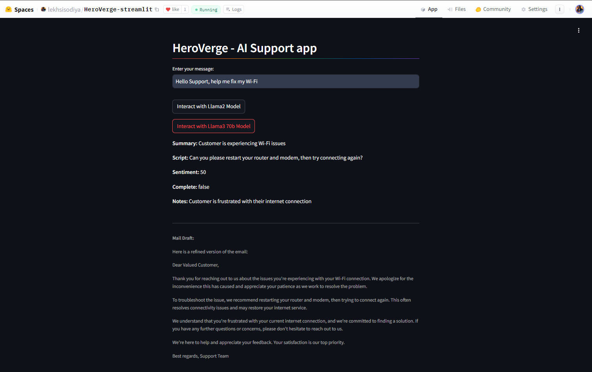

# HeroVerge

HeroVerge is a tool built for providing Gen-AI-based assistance to Support Engineers, maximizing productivity and managing extensive workloads.

## Features

- **Query Handling**: Takes user input as a query and returns responses from a pretrained LLM of the selective choice. Currently available models are: `llama3_70b`, `llama3_8b`, and `llama2`.
- **JSON Responses**: Returns JSON responses with 5 keys: `summary`, `script`, `sentiment`, `complete`, and `notes`. These responses can be configured at the backend to retain ticket data and provide a guide for further resolution.
- **Client Sharable Email**: Frames a client-sharable email to address the query and take forward the next steps. `LangChain` is used to create a chain out of the JSON responses and cook up an email-based response from the JSON created by the AI model.

  ## Technologies Used


## Deployments

There are two deployments of this project across two Python frameworks:

### Flask Version
- Runs on a local server
- Supports robust designs and functionality using HTML, CSS, and JS

### Streamlit Version
- Deployed on Hugging Face
- [Streamlit Deployment Link](https://huggingface.co/spaces/lekhsisodiya/HeroVerge-streamlit)

Both versions have different UI and frontend configurations. Unlike Streamlit/Gradio, Flask supports HTML, CSS, and JS for more robust designs and functionality.

## UI Appearance

### Flask Version (localhost)


### Streamlit Version (Hugging Face)


## Example Test Run Case

- **Query Used**: "Hi support, can you please help me fix my problems with your APIs?"
- **Model Selected**: `llama3_70b`

### API Response
```json
{
  "summary": "Customer is experiencing issues with the APIs",
  "script": "Can you please provide more details about the issues you're facing with our APIs?",
  "sentiment": 50,
  "complete": false,
  "notes": "Customer is experiencing unknown issues with the APIs, need more information to troubleshoot"
}
```


### Future Development
Ticketing System: Facilitate recording and tracking of issues and grant the LLM access to this data to generate insights.
Roles and Permissions: Allot admin and user roles so only admins can create insights from the ticketing database using credentials.

Contact
For more information or to get in touch, please email lekhsisdiya@gmail.com
